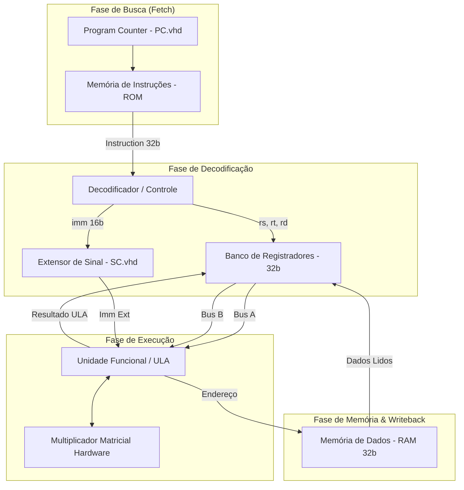

# Processador MIPS 32-bits em VHDL

Hardware síntetizável em VHDL de uma arquitetura de computador MIPS de 32 bits (RISC), com Datapath modular, Unidade Lógica e Aritmética (ULA), Banco de Registradores, Multiplicador Matricial em Hardware, Memória de Instruções (ROM) e Memória de Dados (RAM).

[](https://en.wikipedia.org/wiki/VHDL)
[](https://www.intel.com/content/www/us/en/software/programmable/quartus-prime/overview.html)
[](https://ghdl.github.io/ghdl/)
[](LICENSE)

Trabalho desenvolvido na disciplina de Sistemas Digitais Avançados (SDA) — Engenharia de Computação, Universidade Federal de Pelotas (UFPel).

---

## Sumário

- [Visão Geral da Arquitetura](#visão-geral-da-arquitetura)
- [Diagrama de Blocos do Datapath](#diagrama-de-blocos-do-datapath)
- [Formato das Instruções MIPS](#formato-das-instruções-mips)
- [Estrutura dos Componentes](#estrutura-dos-componentes)
- [Síntese e Simulação](#síntese-e-simulação)
- [Autor](#autor)
- [Licença](#licença)

---

## Visão Geral da Arquitetura

O projeto consiste na descrição completa em hardware (VHDL) do fluxo de dados (*Datapath*) e memória de um processador baseado na arquitetura MIPS de 32 bits. O sistema foi desenvolvido visando a síntese lógica em FPGAs da família Intel/Altera (Quartus Prime) e simulação funcional via ModelSim/GHDL.

### Destaques do Projeto:
- **Fluxo de Dados Modular:** Separação clara entre Datapath, Banco de Registradores, Unidade Funcional (ULA) e Memórias.
- **Multiplicador Matricial em Hardware:** Unidade dedicada de multiplicação de 16/32 bits implementada via matrizes de somadores em hardware (`mult/matricial.vhd`).
- **Memória de Instruções (ROM) e Dados (RAM):** Barramentos de endereço de 8/32 bits com suporte a leitura e escrita síncrona/assíncrona.
- **Banco de Registradores 32-bits:** Suporte a leitura simultânea de 2 registradores e escrita com sinal de habilitação.

---

## Diagrama de Blocos do Datapath



---

## Formato das Instruções MIPS

As instruções de 32 bits processadas pela arquitetura seguem a divisão padrão da literatura MIPS:

| Tipo | 31 .. 26 (6b) | 25 .. 21 (5b) | 20 .. 16 (5b) | 15 .. 11 (5b) | 10 .. 6 (5b) | 5 .. 0 (6b) |
|---|:---:|:---:|:---:|:---:|:---:|:---:|
| **Tipo-R** | `opcode` | `rs` | `rt` | `rd` | `shamt` | `funct` |
| **Tipo-I** | `opcode` | `rs` | `rt` | `immediate [15:0]` | `immediate [15:0]` | `immediate [15:0]` |
| **Tipo-J** | `opcode` | `target [25:0]` | `target [25:0]` | `target [25:0]` | `target [25:0]` | `target [25:0]` |

### Mapeamento dos Campos:
- `opcode = instruction[31:26]`: Código de operação.
- `rs     = instruction[25:21]`: Registrador fonte 1.
- `rt     = instruction[20:16]`: Registrador fonte 2 / destino em Tipo-I.
- `rd     = instruction[15:11]`: Registrador destino em Tipo-R.
- `immed  = instruction[15:0]`: Valor imediato de 16 bits.
- `funct  = instruction[5:0]`: Função específica para instruções do Tipo-R.

---

## Estrutura dos Componentes

```
mips-processor-vhdl/
├── PC.vhd                   # Contador de Programa (Program Counter 32-bits)
├── datapath/
│   ├── datapath.vhd         # Top-level do Fluxo de Dados (Datapath)
│   ├── functionunit.vhd     # Unidade Lógica e Aritmética (ULA) e Shifter
│   ├── registerfile.vhd     # Banco de Registradores de 32-bits
│   ├── SC.vhd               # Lógica de Controle de Sinal / Extensor de Sinal
│   ├── somadorN.vhd         # Somador Genérico N-bits
│   └── somadorN_TB.vhd      # Testbench de simulação do Somador N-bits
├── mem_dados/
│   └── mem_dados_32.vhd     # Memória RAM de Dados (32-bits)
├── mem_instruc/
│   └── mem_32.vhd           # Memória ROM de Instruções (32-bits)
├── mult/
│   ├── matricial.vhd        # Multiplicador Matricial em Hardware (16/32-bits)
│   └── soma16b.vhd          # Somador de 16-bits para o Bloco Multiplicador
├── mips_top.qpf             # Arquivo de Projeto do Intel Quartus Prime
├── mips_top.qsf             # Arquivo de Configuração de Pinos e Síntese Quartus
├── README.md
└── LICENSE
```

---

## Síntese e Simulação

### 1. Síntese em FPGA (Intel Quartus Prime)
1. Abra o arquivo de projeto [`mips_top.qpf`](mips_top.qpf) no **Intel Quartus Prime Lite/Standard**.
2. Selecione a família de FPGA desejada (ex: *Cyclone IV / Cyclone V*).
3. Clique em **Processing -> Start Compilation** (`Ctrl + L`).

### 2. Simulação Funcional (ModelSim / GHDL)
Para compilar e simular os testbenches via **GHDL**:

```bash
# Compilar os componentes do Datapath
ghdl -a datapath/somadorN.vhd datapath/somadorN_TB.vhd

# Gerar a simulação e exportar forma de onda VCD
ghdl -e somadorN_TB
ghdl -r somadorN_TB --vcd=waveform.vcd

# Visualizar ondas no GTKWave
gtkwave waveform.vcd
```

---

## Autor

**João Vitor Kauer Schuck**  
Engenharia de Computação — Universidade Federal de Pelotas (UFPel)  

[GitHub: jvkauer](https://github.com/jvkauer)

---

## Licença

Distribuído sob a licença [MIT](LICENSE).
